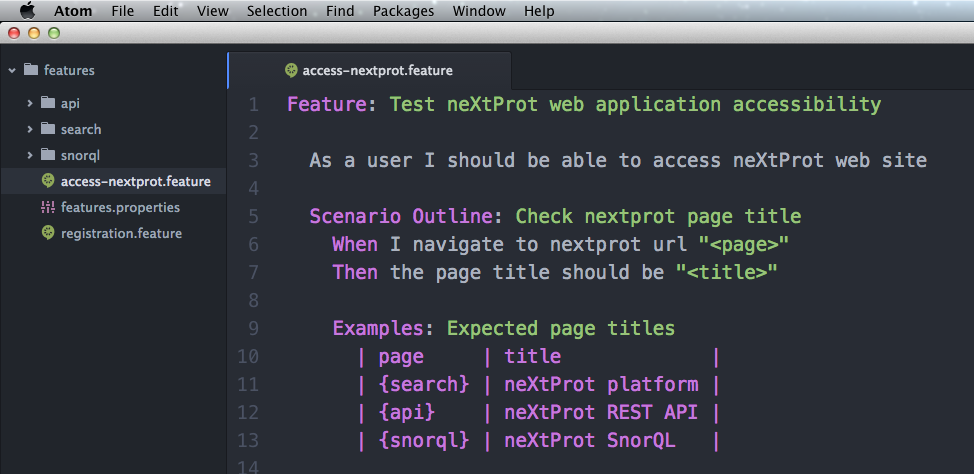

# Writing `user stories` for non-developers

Feature writers need the help of a text editor to create and edit `user-stories`. And depending on their profile, there are some alternative solutions.

Developers already uses [IDE](https://en.wikipedia.org/wiki/Integrated_development_environment) to write code (Eclipse, Intellij, ...) and most of them provides plugins for `cucumber/gherkin`.
Non-developers do not usually need those heavyweight tools.

They need a simpler editor that supports `gherkin` syntax only. In my opinion, this editor should be able to provide:

1. syntax highlighting for `gherkin`
2. auto-completion on existed feature steps

## Editors

Here are the most popular modern editors tested for our needs (that I know at this time :)):

- [Brackets.io](http://brackets.io/), an open source code editor for web designers and front-end developers initiated by adobe
- [Visual-studio-code](https://code.visualstudio.com/?utm_expid=101350005-28.R1T8FshdTBWEfZjY0s7XKQ.0&utm_referrer=https%3A%2F%2Fwww.google.ch%2F) is a code editor by microsoft
- [Atom](https://atom.io/) is a text editor developed by github

2016-11: At that time, `Brackets` and `Visual-studio` actually supports syntax highlighting for gherkin but unfortunately not yet auto-completion :(

`Atom` comes with both needed requirements.

### Installation of `Atom` (+ plugins)

1. First go to web site [https://atom.io/](https://atom.io/) and download the latest release.
2. Launch Atom
3. Click on `Atom/Preferences`
4. Select tab `Install` and search `cucumber` packages
5. Install packages `cucumber` and `cucumber-autocomplete`
6. Select tab `Package` and click on `cucumber-autocomplete` settings, fill `Path` to `/.`

### An example of feature in `Atom`:



## Features in `neXtProt-user-stories`

Some `feature`s have already been written for neXtProt. 
They are available in our GitHub repo named [`nextprot-user-stories`](https://github.com/calipho-sib/nextprot-user-stories/tree/develop/src/test/resources/features).

    A good writer will always try to use best practices whenever it is possible. 
    He will not repeat himself and will reuse existing feature `steps` whenever it is possible.
    
Writer will need to discover already existing steps while writing scenarios via auto-completion.
He will need to have a local access to `features/` folder to profit from full auto-completion in `Atom`.

There are 2 alternatives to get those resources:

### A simple one - Downloading the single folder `features/` from GitHub repository

As Git doesn't support download of a single folder, we will use `DownGit` for that.

1. Open your browser to [DownGit](https://minhaskamal.github.io/DownGit/#/home) 
2. Paste the link `https://github.com/calipho-sib/nextprot-user-stories/tree/develop/src/test/resources/features`
3. Click on `Download` and choose a destination in your system. 
4. Unzip `features.zip`
5. Open folder `features/` with `Atom`

### An advanced one (the most powerful alternative) - Cloning github repository locally

1. `$ git clone https://github.com/calipho-sib/nextprot-user-stories.git`
2. `$ cd nextprot-user-stories/src/test/resources/features/`

Here is a snapshot of auto-complete in action with `Atom`:


> Note that right after typing `gherkin` keywords (`Given`, `And`, `When`, ...), the auto-completion directly proposes existing steps.
It is also possible to type `ctrl-space` to ask for auto-completion.

> Also note that auto-completion in `Atom` actually ONLY WORKS WITHOUT INTERNAL SPACES.

### File `features.properties`

This file contains variables that can be referenced in step definitions.

For example the variable `search` is referenced in the following step:
```
I navigate to url of nextprot "search"
```

Here variable "search" is an alias for url "http://dev-search.nextprot.org/".

